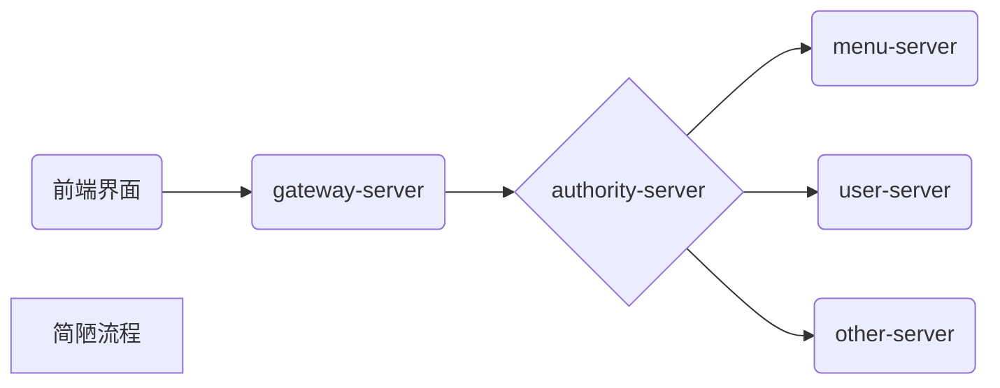

# managerment

为加深知识理解而做的`Demo`(持续中)

***

# 项目结构

+ `authority-server` 权限管理中心
+ `gateway-server` 网关服务
+ `menu-server` 菜单服务
+ `user-server` 用户服务
+ `common-api` 通用模块

# 流程

```mermaid
graph LR
A(前端界面) --> B(gateway-server)
    B --> C{authority-server}
    C --> D(menu-server)
    C --> E(user-server)
    C --> F(other-server)
    G[简陋流程]
```

*太菜了我*

