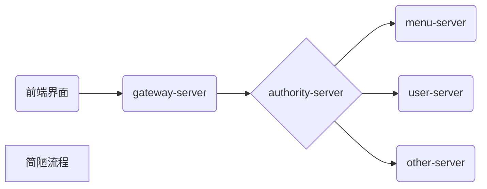

# managerment

为加深知识理解而做的`Demo`

***

# 项目结构

+ `authority-server` 权限管理中心
+ `gateway-server` 网关服务
+ `goods-server` 商品服务
+ `user-server` 用户服务
+ `common-api` 通用模块
+ `miaosha-server` 秒杀服务

# 流程

# 技术栈
+ `nacos` 注册中心、配置服务
+ `gateway` 网关服务
+ `openfeign` 服务调用
+ `shiro` 安全管理
+ `redis` 数据存储 
+ `mysql` 数据库
+ `mybatisplus` 
+ `rabbitmq` 消息队列

*太菜了我*

